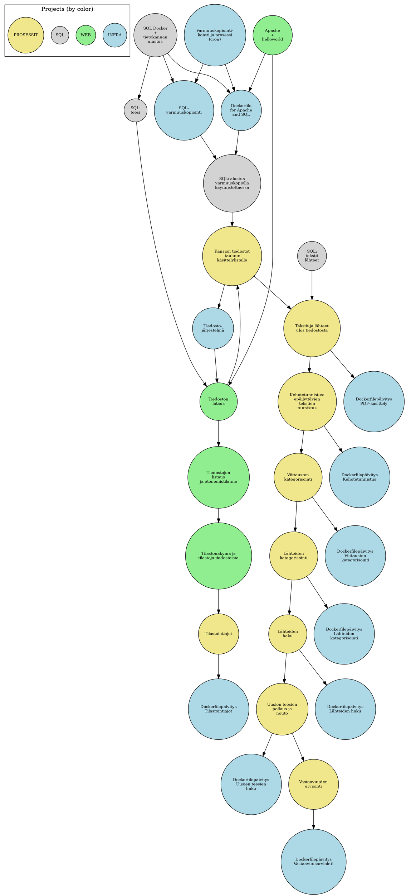

# refhandler

Refhandler - full chain of tools for writers and advisors of scientific articles and thesis, from managing the corpus of works and references to interfacing with LLM models for evaluating use of references and citations.

## Refhandler components

#TODO update components

- [Frontend](frontend): React frontend
- [Postgres](postgres): Relational SQL database
- [compose.yaml](compose.yaml): Configuration and deployment of project's docker containers
- [.env](.env): Environmental variables

## Deployment

1. Install `docker` and `docker compose` if you using Linux OR install `docker desktop` (required for Windows and MacOS)
1. Clone the Refhandler repository
2. Change `POSTGRES_PASSWORD` and `SECRET_KEY` in `.env` file
3. Open a terminal in the project root folder
4. Start the compose stack with the command `docker-compose up`
5. Navigate to <http://localhost:5173/> on your browser

## Troubleshooting

### Some of the containers do not start

Make sure old versions of the containers aren't running with the command `docker compose down` before trying to start the compose file again.

### Containers Postgres, Backend, Frontend do not start

Sometimes older instances of the Postgres container don't free the Postgres port, preventing newer instances from starting.

- **Fix on windows:** Restart the NAT driver with the commands `net stop winnat; net start winnat` (requires administrator powershell or command prompt)
- **Fix on linux:** #TODO if the problem isn't windows only

### Backend and Frontend aren't starting, docker logs show errors related to alembic or database operations

Backend failed to apply alembic database migrations, leaving the database tables and the SQLmodel tables in `/backend/app/models.py` in an incompatible state.

1. Not all SQLmodel changes are compatible with alembic autogeneration. Try adjusting autogenerated migration scripts in the folder `/backend/alembic`. See alembic documentation for details.
2. Delete the alembic migration scripts and drop the `alembic` table from the database using the Adminer dashboard.
3. If all else fails, delete the database volume `refhandler_postgres_data`, restart the postgres container and restore from backups (inside volume `refhandler_postgres_backups` on the host, or `/backups` inside the postgres container) by hand

## Plan:

Main

- Query CorpusManager for jobs
- Start processing jobs

DatabaseWrapper

- Keep all database -related code in one place to permit database migration depending on need
- Start with SQLite?

CorpusManager

- Manage a database including:
- ...WORKS: of the assessed works in the work directory, including year of publication, institution, faculty etc. information 
- ...REFS: of the referenced works, including on whether work is available, has been downloaded to references directory
- ...REFTEXT: of reference and citation texts including 1:1 relation to WORKS
- ...REFTAXONOMY: a taxonomy of reference types, including a description of the taxonomy
- ...TYPE: reference types (N:1) related to specific TAXONOMY
- ...REFREF: N:N relation table between REFTEXT and REFS
- ...REFTYPE: TYPE classification of REFTEXT given by LLM model for specific REFTAXONOMY
- ...LLM: LLM models and versions available 
- ...ASSESSMENT: assessments of REFTEXT by specific LLM
- Provide a job list for subsequent actions

LLMinterface

- Provide interface to pose prompts to LLM models via API or to locally run models
- Prompt injection recognition :P
- Provide a list of LLM models with version info

ReferenceExtractor

- Process through a given work and extract:
  - Necessary data to table WORKS
  - The list of references and add to table REFS
  - Each reference and citation to table REFTEXT and REFREF and add an empty PDF annotation with REFTEXT row ID to add the annotation later

ReferenceClassifier

- Given a reference text, query available LLM's to classify the reference according to each available REFTAXONOMY to TYPE
- Annotate WORKS pdf with the outcome

ReferenceFetcher

- Given a reference, try to obtain original PDF text and update REFS table

ReferenceAssessment

- Given a REFTEXT, REFTYPE and REFS entry with available PDF, query available LLM's on the accuracy of the reference
- Annotate WORKS pdf with the outcome
- Update ASSESSMENT entry with results

Statistics

- Provide statistics and export CSV results

## Development project plan:

